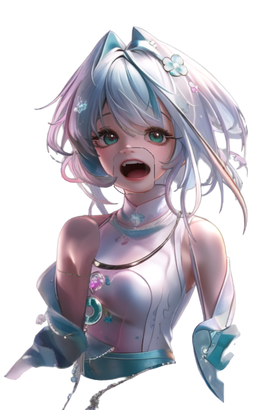
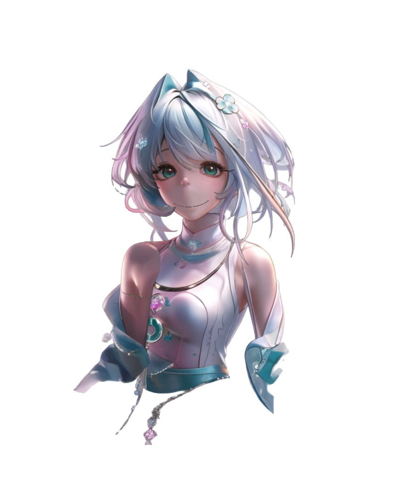
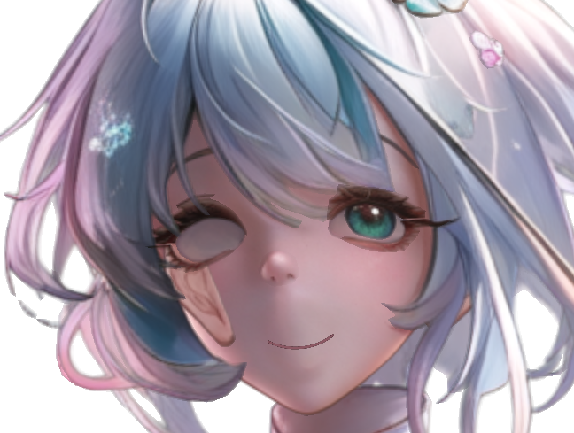
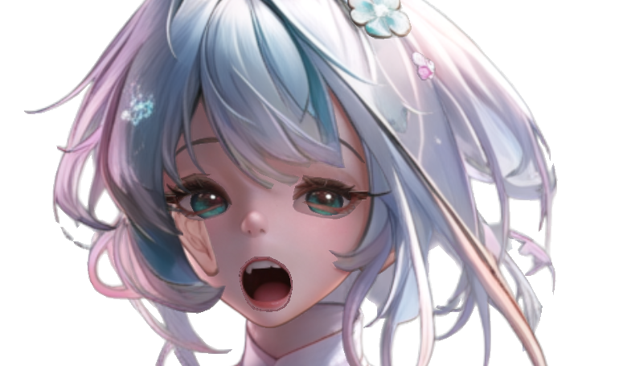

# Live2D Auto Pipeline

从单张二次元立绘到 Live2D `moc3` 的本机流水线实验记录：**See-through 语义拆层 → PSD 预检/层序修复 → psd2live 自动绑骨**。

> 本仓库是工作流与结果归档，**不含**模型权重、密钥与个人本机绝对路径。

---

## 硬件与软件配置（本机实测）

| 项目 | 配置 |
|------|------|
| GPU | NVIDIA GeForce **RTX 4060 Laptop**（约 8GB VRAM） |
| 内存 | 约 16GB |
| 系统 | Windows |
| 推理 | Python 3.11 + PyTorch 2.6.0+cu124 |
| 拆层 | [See-through](https://github.com/shitagaki-lab/see-through)（LayerDiff + Marigold） |
| 绑骨 | [psd2live](https://github.com/tsunehimatoi/psd2live) v0.7.1 |
| 辅助 | jpg-to-live2d-workflow（改名 / 预检 / 拆睫毛） |

### 推荐档位（时间与质量平衡）

```text
See-through: resolution=768  steps=30  tblr=ON  group_offload=ON
Marigold:    单独进程，group_offload=OFF
HF_HUB_OFFLINE=1
psd2live:    --mesh-spacing 48 --atlas 4096
```

半身图实测：LayerDiff 约 **32 分钟**（768/30）。1280/30 在 8GB 卡上可达数小时，不推荐日常使用。

关键补丁：UNet 加载需 `low_cpu_mem_usage=True`，否则约 16GB 内存下易出现 ACCESS_VIOLATION。

---

## 示例结果（768/30）

输入：半身、**张嘴**、背景较干净的立绘。

### 源图与运行结果

| 源图（张嘴原画） | 张嘴状态 | 闭嘴状态（压合） |
|------------------|----------|------------------|
|  |  |  |

- 脸部预览：`results/test03_v3_face_preview.png`
- 可加载模型包：`results/test03_768_v3/`

### 常见问题截图（自动链路实测）

| 问题 | 截图 |
|------|------|
| 右眼全白（眼白盖住瞳孔） |  |
| 嘴层无唇线 |  |
| 脸颊误检耳朵 + 闭嘴怪异 |  |
| test02 眨眼空眼 |  |

### 结论摘要

1. **眼 / 嘴差分是自动链路主要短板**
   - 闭眼依赖睫毛 U 形 + 眼白收缩；分层差时会「发白空眼」。
   - 嘴用最大张口图向中线压缩模拟闭口，无独立闭口差分时观感发怪。
   - 复杂表情需要**手动差分**（如 `mouth_close`）或 Cubism 精修 `.cmo3`。

2. **See-through 配置高、耗时长**
   - 需要 NVIDIA CUDA 与数 GB 权重。
   - 8GB 卡推荐 768/30 + group_offload。
   - 无成熟「非 See-through」语义拆层替代（连通域 / 设定图裁切不可用）。

3. **层序与误检必须后处理**
   - `eyewhite` 若在 `irides` 之上会导致单眼全白。
   - 可能把耳朵误检到脸颊。
   - 见 `docs/test03-eye-mouth-diagnosis.md` 与 `scripts/fix_test03_ears_mouth.py`。

4. **原画决定上限**
   - 嘴必须张开；半身优于全身小脸；身体正立、背景干净。

---

## 推荐流水线

```text
合格原画
  → See-through 768/30 + group_offload（Marigold 单独跑）
  → 侧别改名 / 预检 / 拆睫毛
  → 层序重排（eyewhite 在 irides 之下，back hair 在底层）
  → 修正误检层、必要时用原图重采嘴部
  → psd2live mesh48 / atlas4096
  → vts_check → 导入 VTube Studio
```

详见 `docs/recommended-live2d-pipeline.md`。

---

## 脚本

| 脚本 | 用途 |
|------|------|
| `scripts/run_decompose.py` | See-through 无界面拆层 |
| `scripts/finish_decompose.py` | Marigold 深度 + 组 PSD |
| `scripts/reorder_live2d_psd.py` | 按 Live2D 绘制序重排层 |
| `scripts/fix_test03_ears_mouth.py` | 去掉脸颊误检耳朵、用原图重采嘴部 |
| `scripts/write_psd_v3.cjs` | ag-psd 写出 Cubism 可读 PSD |

路径请按本机修改；**不要**提交含 token 的真实 `config.json`。示例见 `config.example.json`。

---

## 第三方与许可

- 本仓库文档与脚本：MIT
- See-through：Apache-2.0
- psd2live：GPL-3.0
- Live2D / Cubism / moc3 商标归 Live2D Inc.

生成模型的商用与平台规则（例如部分市场对 AI 立绘的限制）需自行确认。
