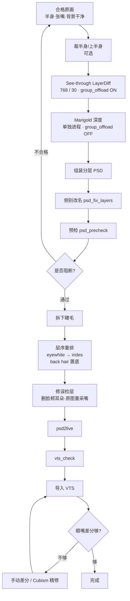

# 实际工作流流程图

## 端到端

```mermaid
flowchart LR
  IN[立绘 PNG/JPG] --> SD[See-through<br/>语义拆层 768/30]
  SD --> PSD[分层 PSD]
  PSD --> FIX[改名/预检/拆睫毛<br/>层序重排/修误检]
  FIX --> RIG[psd2live mesh48 atlas4096]
  RIG --> OUT[moc3 全套 + cmo3]
  OUT --> VTS[VTS 加载 / Cubism 精修]
```

## 详细步骤

```mermaid
flowchart TB
  A[合格原画<br/>半身·张嘴·背景干净] --> B[裁半身/上半身<br/>可选]
  B --> C[See-through LayerDiff<br/>768 / 30 · group_offload ON]
  C --> D[Marigold 深度<br/>单独进程 · group_offload OFF]
  D --> E[组装分层 PSD]
  E --> F[侧别改名 psd_fix_layers]
  F --> G[预检 psd_precheck]
  G --> H{是否阻断?}
  H -->|不合格| A
  H -->|通过| I[拆下睫毛]
  I --> J[层序重排<br/>eyewhite → irides<br/>back hair 置底]
  J --> K[修误检层<br/>删脸颊耳朵·原图重采嘴]
  K --> L[psd2live]
  L --> M[vts_check]
  M --> N[导入 VTS]
  N --> O{眼嘴差分够?}
  O -->|不够| P[手动差分 / Cubism 精修]
  P --> N
  O -->|够| Q[完成]
```